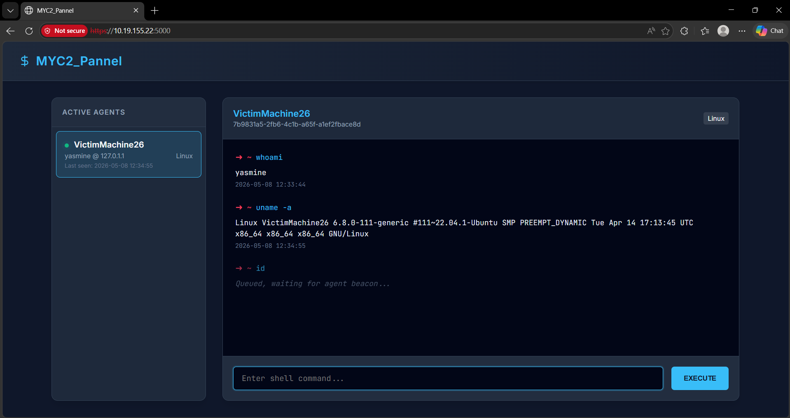

# MYC2_Pannel

A modern, encrypted Command and Control (C2) server with a web dashboard, using **AES-256-GCM** for payload encryption and **TLS (HTTPS)** for transport security.

## Environment & Scenario

This project is designed to simulate a realistic Command and Control scenario within an internal network environment:
- **Attacker Machine:** Kali Linux (Running the C2 Server & Dashboard)
- **Victim Machine:** Ubuntu (Running the Agent)
- **Network:** Internal network where both machines can communicate via IP addresses (e.g., `192.168.100.x`).
- **Communication:** The victim uses DNS spoofing/forwarding to resolve a fake domain (`micros0ft-update.com`) directly to the Kali attacker's IP address.

## Project Structure

```
.
├── README.md          ← Complete instructions
├── server.crt         ← TLS certificate (self-signed, git-ignored)
├── server.key         ← TLS private key (git-ignored)
├── server/            ← C2 server source code
│   ├── server.py      ← Main entry point (HTTPS enabled)
│   ├── crypto.py      ← AES-256-GCM encryption logic
│   ├── routes_c2.py   ← API routes for the agent
│   ├── routes_ui.py   ← API routes for the web interface
│   ├── state.py       ← Shared global variables
│   └── templates/     ← HTML User Interface (MYC2_Pannel)
├── agents/            ← Agent source code
│   └── agent.py       ← Agent executable
├── config/            ← Configuration files
│   └── dnsmasq.conf   ← DNS Spoofing configuration
└── requirements.txt   ← Python dependencies
```

## Installation

```bash
# Install dependencies
pip install flask cryptography requests --break-system-packages

# Install and start dnsmasq (Kali only)
sudo apt install dnsmasq -y
sudo cp config/dnsmasq.conf /etc/dnsmasq.conf
sudo systemctl start dnsmasq
```

---

## TLS Certificate Setup

The C2 server runs over **HTTPS** using a self-signed TLS certificate. You must generate the certificate before starting the server.

### Generate the self-signed certificate (on Kali)

```bash
openssl req -x509 -newkey rsa:2048 -keyout server.key -out server.crt -days 365 -nodes -subj "/CN=micros0ft-update.com"
```

This command:
- Creates a **2048-bit RSA** private key (`server.key`)
- Creates a self-signed **X.509 certificate** (`server.crt`) valid for **365 days**
- Uses `-nodes` to skip passphrase protection on the key
- Sets the Common Name (CN) to `micros0ft-update.com`

> **Note:** The `server.key` and `server.crt` files are listed in `.gitignore` and should **never** be committed to version control.

### Why HTTPS?

| Layer | Protection |
|-------|-----------|
| **TLS (Transport)** | Encrypts the entire HTTP connection — headers, URLs, and body — preventing network-level eavesdropping and man-in-the-middle attacks. |
| **AES-256-GCM (Payload)** | Encrypts the command/response data inside the HTTP body, providing end-to-end confidentiality even if TLS is intercepted or stripped. |

Using both layers together provides **defense in depth**: TLS protects the channel, and AES-256-GCM protects the payload.

---

## DNS Configuration (Victim)

The agent is configured to connect to `https://micros0ft-update.com:5000`. You must point this domain to your Kali IP address (for example `192.168.100.30`).

**On Ubuntu victim — point DNS to Kali:**
```bash
sudo resolvectl dns enp0s9 192.168.100.30
```

*Note: If you do not use `resolvectl` (or for a quick test), you can also modify `/etc/hosts`:*
```bash
echo "192.168.100.30 micros0ft-update.com" | sudo tee -a /etc/hosts
```

**Verify:**
```bash
nslookup micros0ft-update.com
# Expected: Address: 192.168.100.30
```

---

## Usage

**1. Generate the TLS certificate (first time only, on Kali):**
```bash
openssl req -x509 -newkey rsa:2048 -keyout server.key -out server.crt -days 365 -nodes -subj "/CN=micros0ft-update.com"
```

**2. Start C2 server (Kali):**
```bash
cd server
python3 server.py
```

**3. Start agent (Ubuntu victim):**
```bash
cd agents
python3 agent.py
```

**Web interface:** https://localhost:5000

> ⚠️ Your browser will show a certificate warning because the certificate is self-signed. This is expected — accept the warning to access the dashboard.

> ℹ️ The agent uses `verify=False` to bypass certificate validation for the self-signed certificate.

---

## Encryption

- Algorithm : AES-256-GCM
- Key size  : 256 bits (32 bytes)
- Nonce     : 12 bytes random per message
- Transport : Base64 over HTTPS (TLS)

## Traffic Capture & Log Generation

This section documents the C2 traffic capture and analysis process used to generate network logs for detection analysis.

### Overview

We captured **all network traffic** between the C2 server (Kali, attacker) and the compromised agent (Ubuntu, victim) during a simulated attack over approximately 1 hour. The raw binary PCAP file was then processed into three structured CSV log files using **tshark**, enabling systematic analysis of connection patterns, encryption signatures, and DNS behavior.

### Capture & Execution Process

**Starting the packet capture (victim machine):**

We initialized tcpdump on the victim to capture all traffic on port 5000:

```bash
sudo tcpdump -i eth0 port 5000 -w ~/capture_c2.pcap
```

This captured packets to `capture_c2.pcap` for the duration of the test.

**Simulating attacker behavior (via C2 dashboard):**

While tcpdump was running, we accessed the C2 dashboard via https://localhost:5000 in a browser. We systematically executed reconnaissance commands through the agent interface one at a time, observing beaconing behavior (~78 second intervals between commands):



```
whoami
id
uname -a
hostname
cat /etc/passwd
ls -la /home
ps aux
df -h
ip route
uptime
```

This simulated a realistic attacker discovering victim system information and configuration. Each command traversed the encrypted C2 channel and was recorded in the packet capture.

### Log Generation from PCAP Data

The raw PCAP file is binary and cannot be analyzed directly—tshark was used to extract and convert captured traffic into three structured CSV log files.

#### Connection Log (conn.log)

We extracted TCP connection metadata to understand traffic patterns and beacon timing:

```bash
sudo tshark -r ~/capture_c2.pcap \
  -T fields \
  -e frame.time_epoch \
  -e ip.src \
  -e ip.dst \
  -e tcp.srcport \
  -e tcp.dstport \
  -e frame.len \
  -e tcp.flags \
  -E separator=, \
  -E header=y \
  > conn.log
```

**What this captures:** Every TCP connection (handshakes, data transmission, connection close) with precise timestamps, IP addresses, ports, packet sizes, and TCP flags indicating connection state.

**Example record:**
```
1778267918.860245,10.19.155.241,10.19.155.22,7045,5000,66,0x0002
```

This shows: at Unix timestamp 1778267918.86, the victim machine (10.19.155.241) sent a 66-byte SYN packet (flag 0x0002) to the C2 server (10.19.155.22) on port 5000, marking the initiation of a new beacon connection. By analyzing these records, detection systems can identify periodic beaconing behavior and data transfer volumes.

---

#### TLS/SSL Log (ssl.log)

We extracted TLS handshake data to capture encryption signatures:

```bash
sudo tshark -r ~/capture_c2.pcap \
  -Y "tls.handshake" \
  -T fields \
  -e frame.time_epoch \
  -e ip.src \
  -e ip.dst \
  -e tls.handshake.type \
  -e tls.handshake.ciphersuite \
  -e tls.handshake.version \
  -E separator=, \
  -E header=y \
  > ssl.log
```

**What this attempts to capture:** TLS handshake parameters (version, cipher suites, extensions) which form the **JA3 fingerprint**—a signature identifying the TLS client library even without decryption.

**What we found:** The log is **empty or sparse**. This is expected and significant: AES-256-GCM encryption is effective enough that tshark cannot fully parse the TLS session. The protocol is misidentified as `gsm_ipa`, which actually **confirms our encryption is working properly**. Legitimate C2 tools would show similar signatures, making them hard to detect purely through TLS metadata.

---

#### DNS Log (dns.log)

We extracted all DNS queries during the capture window:

```bash
sudo tshark -r ~/capture_c2.pcap \
  -Y "dns" \
  -T fields \
  -e frame.time_epoch \
  -e ip.src \
  -e ip.dst \
  -e dns.qry.name \
  -e dns.a \
  -E separator=, \
  -E header=y \
  > dns.log
```

**What we found:** The log is **completely empty**. This is intentional and reveals an evasion technique: the victim resolves `micros0ft-update.com` via the local `/etc/hosts` file rather than network DNS queries. No DNS traffic is generated, leaving zero forensic evidence of domain resolution. **This absence itself is a detection signal**—in real investigations, a machine connecting to a domain without corresponding DNS queries suggests DNS-based evasion, a common attacker technique. 

